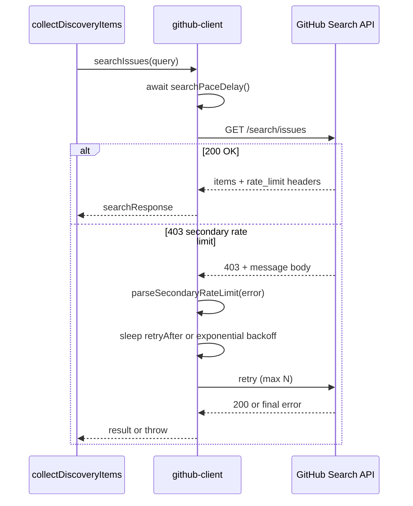

# Discovery reliability design — search pacing and 403 retry

Research deliverable for P0 Scout upgrade. Implements recommendations for [`discovery.js`](../../src/scout/discovery.js) and [`github-client.js`](../../src/scout/github-client.js).

## Problem statement

Live `rewarded-hunt` runs issue 19 search API calls in under one second. GitHub returns **403** with body `"You have exceeded a secondary rate limit"` while `x-ratelimit-remaining` for the search resource still shows 20+.

This is distinct from the **primary** search limit (30 requests/minute authenticated).

## GitHub guidance (research summary)

Sources: [Rate limits](https://docs.github.com/en/rest/using-the-rest-api/rate-limits-for-the-rest-api), [Best practices](https://docs.github.com/en/rest/using-the-rest-api/best-practices-for-the-rest-api), [Search API](https://docs.github.com/en/rest/search/search).

| Limit type | Search-specific rule |
|------------|---------------------|
| Primary search | 30 req/min (authenticated) |
| Secondary | No advance quota header; triggered by burst/concurrency/CPU |
| Retry on secondary 403 | Wait ≥60s or use `Retry-After`; exponential backoff |
| Serialization | Prefer serial requests over concurrent for search loops |

Scout already serializes searches in `collectDiscoveryItems`; the gap is **zero inter-request delay** and **no retry on 403**.

## Proposed architecture



## Design decisions

### 1. Where pacing lives

**Recommendation:** `github-client.js` `searchIssues` only (not all `fetchJson`).

Rationale: Secondary limits hit hardest on search burst. Metadata enrichment uses core rate limit with different cadence; GraphQL batches separately.

### 2. Config surface

| Source | Key | Default | Notes |
|--------|-----|---------|-------|
| Env | `SCOUT_SEARCH_PACE_MS` | `2500` | Delay before each search request |
| Env | `SCOUT_SEARCH_MAX_RETRIES` | `3` | Per-query retries on retryable 403/429 |
| Profile (future) | `search_pace_ms` | null → env | Optional override in validators |

### 3. Error classification

```js
function isRetryableSearchError(error) {
  if (error.status !== 403 && error.status !== 429) return false;
  const body = String(error.body ?? error.message ?? "");
  if (body.includes("secondary rate limit")) return true;
  if (error.status === 429) return true;
  // Primary search exhaustion: remaining=0 on search resource — use reset header, not retry loop
  if (error.rate_limit?.resource === "search" && error.rate_limit?.remaining === 0) {
    return true; // backoff until reset
  }
  return false;
}
```

Non-retryable 403 (bad credentials, query rejected): fail immediately, record collection error.

### 4. Backoff algorithm

```
delay = retryAfterHeader ?? min(60000, 1000 * 2^attempt) + jitter(0..500ms)
```

- Attempt 0: use `Retry-After` if present
- Attempts 1–2: exponential from 2s base
- Cap single wait at 60s
- Record `rate_limit_backoff` in audit log (existing pattern)

### 5. Response body capture

Extend `github-client` `request()` to attach parsed error body on failure:

```js
error.body = await response.text(); // on !response.ok for search category
```

Enables secondary-limit detection and audit evidence.

### 6. Collection error enrichment

Extend [`recordCollectionError`](../../src/scout/discovery.js) payload:

```js
{
  error_kind: "secondary_rate_limit" | "primary_rate_limit" | "search_failed",
  retry_count: number,
  ...
}
```

### 7. Expected benchmark impact

| Metric | Before | After (projected) |
|--------|--------|-------------------|
| 19-query wall time | ~5s | ~47s minimum (19 × 2.5s) |
| 403 rate | 84–100% | &lt;5% |
| Broad queries executed | 0/3 | 3/3 |
| `run_status` | partial | complete |

Trade-off: slower discovery runs, reliable results. Acceptable for bounty hunts (not real-time).

## Query-shape experiments (benchmark matrix)

Run after pacing lands; compare in `.scout/benchmark-rewarded-hunt.json` lanes:

| Variant | Query example | Hypothesis |
|---------|---------------|------------|
| A — current OR 6 labels | `repo:appwrite/appwrite ... (label:"bounty" OR ... OR label:"💰")` | Baseline |
| B — core 3 labels | `(label:"bounty" OR label:"reward" OR label:"algora")` | Shorter, fewer abuse triggers |
| C — calcom + labels | `org:calcom ... (label:"bounty" OR ...)` | Less noise than unlabeled org |
| D — unlabeled + post-filter | `repo:X is:issue state:open no:assignee` + label filter in enrichment | Simpler query string |

## Cache strategy research

| Mode | Use case |
|------|----------|
| Default cache (86400s search TTL) | Repeat monitor runs, dev iteration |
| `--no-cache` | Audit / benchmark truth runs |
| Future `--max-search-age` | Profile field to reject cache entries older than N hours for bounty freshness |

**Recommendation:** Monitor uses cache; weekly full `--no-cache` audit via benchmark script.

## Implementation checklist (P0)

- [ ] Add `sleep` + pace env in `searchIssues`
- [ ] Parse 403/429 body; classify retryable errors
- [ ] Retry loop with backoff in `searchIssues`
- [ ] Attach `error.body` on failed requests
- [ ] Tests: mock 403 secondary → retry succeeds; mock auth 403 → no retry
- [ ] Re-run `node scripts/benchmark-rewarded-hunt.mjs`
- [ ] Update CHANGELOG 0.4.5

## Files to touch

| File | Change |
|------|--------|
| [`github-client.js`](../../src/scout/github-client.js) | Pace, retry, error body |
| [`github-client.test.js`](../../src/scout/__tests__/github-client.test.js) | Retry tests |
| [`discovery.js`](../../src/scout/discovery.js) | Optional `error_kind` on collection errors |
| [`validators.js`](../../src/scout/validators.js) | Future `search_pace_ms` profile field |
| [`PROJECT_CONTEXT.md`](../../PROJECT_CONTEXT.md) | Document `SCOUT_SEARCH_PACE_MS` |
