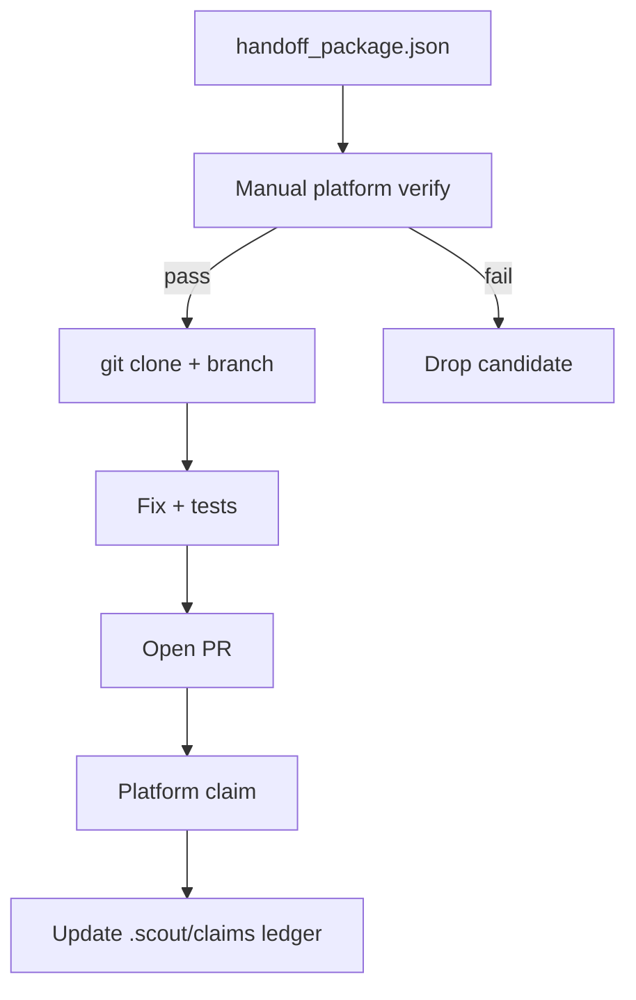

# Bounty claim runbook

Agent-neutral runbook for the **post-Scout** phase: verifying payout and working toward cash-in. Scout discovery ends at `handoff_package.json`; this runbook covers steps 2–4 of the cash-in funnel.

## Harness

Use from any agent that received a Scout handoff with `discovery_intent: rewarded`. Read [`report-review-runbook.md`](report-review-runbook.md) first.

## Allowed operations (harness)

- Read GitHub issue/PR pages (browser or API)
- Read Algora/IssueHunt console pages (read-only verification)
- `git clone`, branch, commit, push (with human approval)
- Open PR via `gh pr create` (with human approval)

## Denied operations (Scout CLI)

Scout itself must not: post GitHub comments, open PRs, claim bounties, or verify payout as truth.

## Claim readiness checklist

Before writing code, confirm **all** for the candidate:

| # | Check | Pass criteria |
|---|-------|---------------|
| 1 | Verdict | GREEN or YELLOW with explicit human approval for inferred reward |
| 2 | Platform status | Bounty page shows **open** / **fundable** (manual browser check) |
| 3 | Payout terms | Amount and currency match issue signals or platform page |
| 4 | Acceptance criteria | Issue body or linked doc defines done |
| 5 | Assignment | No assignee; issue state `open` |
| 6 | Competition | No merged/linked PR that likely solves the issue |
| 7 | License | Repo license permits contribution |
| 8 | Claim instructions | CONTRIBUTING.md or issue body describes claim path |
| 9 | Stack fit | You can build/test in the repo's primary language |
| 10 | Effort vs payout | ROI acceptable (see [`roi-ranking-design.md`](../../docs/research/roi-ranking-design.md)) |

If any check fails, **stop** or downgrade to manual research.

## Platform-specific claim flows

### Algora

1. Open `platform_url` from reward signals (or search Algora console by repo/issue).
2. Confirm bounty amount and status.
3. Comment on GitHub issue that you are working on it (manual; not Scout).
4. Fork → branch → implement → open PR referencing issue.
5. Submit claim in Algora console when PR is ready (per program rules).
6. Await maintainer review and merge; payout triggers per Algora terms.

### IssueHunt

1. Open IssueHunt issue URL from reward signals.
2. Confirm funding status on IssueHunt.
3. Implement and open PR.
4. Complete IssueHunt claim flow after merge.

### Trusted seed, no platform URL

1. Treat as **YELLOW** until platform or maintainer confirms payout.
2. Check repo CONTRIBUTING.md for program link.
3. Do not assume GitHub `bounty` label alone means paid work.

## Suggested harness workflow



## Claim ledger (optional local tracking)

Create or update `.scout/claims/ledger.json`:

```json
{
  "claims": [
    {
      "issue_url": "https://github.com/org/repo/issues/42",
      "candidate_id": "SCOUT-org-repo-42",
      "status": "pr_open",
      "platform_claim_url": "https://algora.io/bounties/example",
      "pr_url": "https://github.com/org/repo/pull/99",
      "claimed_at": "2026-06-23T12:00:00.000Z",
      "paid_at": null
    }
  ]
}
```

Statuses: `researching` → `claimed` → `pr_open` → `merged` → `paid` | `abandoned`

### CLI commands

```powershell
scout claims list
scout claims add --issue-url https://github.com/org/repo/issues/42 --candidate-id SCOUT-org-repo-42 --status claimed --platform-claim-url https://algora.io/bounties/example
scout claims update --issue-url https://github.com/org/repo/issues/42 --status pr_open --pr-url https://github.com/org/repo/pull/99
```

`scout monitor` always loads the ledger and skips issues with status `claimed`, `pr_open`, `merged`, or `paid`. With `--skip-known`, monitor snapshot keys are merged into the same skip set.

Feed ledger into `scout monitor --skip-known` to avoid re-recommending active work.

## Scout commands (read-only, during claim phase)

```powershell
scout explain --candidate-id SCOUT-org-repo-42 --report scout_report.json
scout validate-report --report scout_report.json
scout cockpit --report scout_report.json
```

## Risks and unknowns

- Scout `estimated_reward_usd` is **inferred** from GitHub text, not platform truth.
- Spam bounty farms may pass broad search; prefer `rewarded-trusted-only` for lower spam risk.
- Platform ToS may require identity verification before payout.
- Tax/reporting is the contributor's responsibility.

## Related documents

- [Scout bounty audit](../../docs/research/scout-bounty-audit-2026-06-23.md)
- [Bounty platforms survey](../../docs/research/bounty-platforms.md)
- [Handoff schema 1.2 research](../../docs/research/handoff-schema-research.md)
- [Decision cockpit runbook](decision-cockpit-runbook.md)
